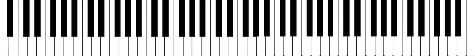

Er zijn 88 muzieknoten beschikbaar in de `picozero` bibliotheek. Ze linken naar westerse muzikale notatie en zijn alle noten die je kunt vinden op een toetsenbord van volledige grootte.

De beschikbare noten zijn:

+ b0
+ c1
+ c#1
+ d1
+ d#1
+ e1
+ f1
+ f#1
+ g1
+ g#1
+ a1
+ a#1
+ b1
+ c2
+ c#2
+ d2
+ d#2
+ e2
+ f2
+ f#2
+ g2
+ g#2
+ a2
+ a#2
+ b2
+ c3
+ c#3
+ d3
+ d#3
+ e3
+ f3
+ f#3
+ g3
+ g#3
+ a3
+ a#3
+ b3
+ c4 - Dit is de middelste C op een toetsenbord
+ c#4
+ d4
+ d#4
+ e4
+ f4
+ f#4
+ g4
+ g#4
+ a4
+ a#4
+ b4
+ c5
+ c#5
+ d5
+ d#5
+ e5
+ f5
+ f#5
+ g5
+ g#5
+ a5
+ a#5
+ b5
+ c6
+ c#6
+ d6
+ d#6
+ e6
+ f6
+ f#6
+ g6
+ g#6
+ a6
+ a#6
+ b6
+ c7
+ c#7
+ d7
+ d#7
+ e7
+ f7
+ f#7
+ g7
+ g#7
+ a7
+ a#7
+ b7
+ c8
+ c#8
+ d8
+ d#8 